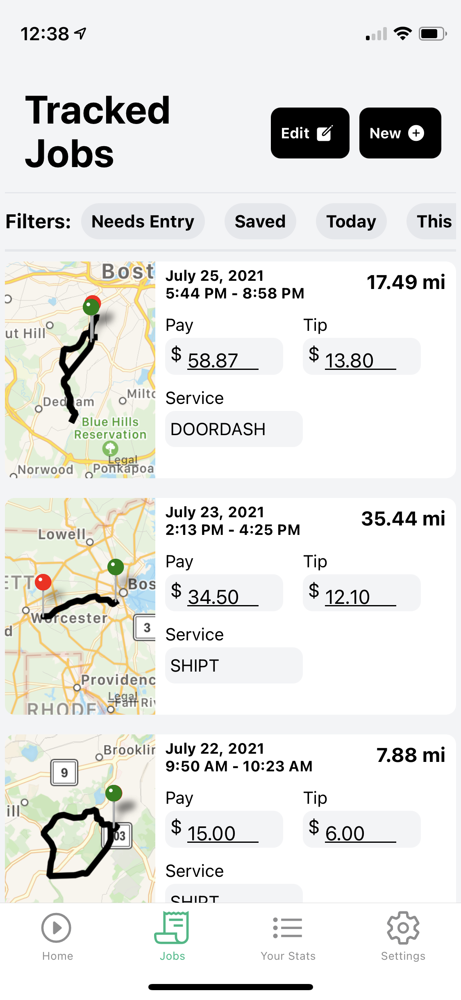

# gigbox

Gigbox is an open-source tracker developed with & for gig workers that lets workers track and share their pay,
mileage, expenses, and other information about their work for free. 

Gigbox is part of the [gigbox project at the MIT Media lab's Human Dynamics Group](https://gigbox.media.mit.edu/), started
by PhD student [Dan Calacci](https://twitter.com/dcalacci). 

## Features:

- 🆓 Free and open-source
- 📍 Automatic mileage tracking using [OSRM](http://project-osrm.org/) for mileage and expense tracking.
- 🚗 Track shifts _and_ jobs, so you know how much time you've spent waiting for work
- 📲 Track multiple apps, so you can compare your effective hourly pay between services
- 📈 Easily see your work history — pay, tips, mileage, and time — using powerful filters to select only certain jobs
- 📸 Attach screenshots and other images to your jobs to keep track of additional expenses, proof of delivery, and other info.
- ↗️ Export your data quickly and easily
- 🔐 Private: data is governed by MIT's Institutional Review Board (IRB) - your data will never be sold, and only shared with your explicit permission.
- Contribute research data to Dan's PhD dissertation by answering surveys about your work experience :)

### 🔜 In the near future:
- Upload screenshots from your apps to automatically track pay, tips, and other detailed info
- 🧾 Export PDF reports of your mileage and pay you can use for tax purposes, your own records, or to easily share your work history with others
- 🗺 Map out your jobs to see where your best tippers and shops have been in the past
- 👷 Share your data with other workers to see anonymous aggregate information about other people's pay, working habits, and tips in your area.

## Screenshots
<table>
  <tr>
    <td>Automatically track mileage </td>
     <td>Easily view your past jobs</td>
     <td>Keep track of your work history</td>
  </tr>
  <tr>
    <td></td>
    <td></td>
    <td></td>
  </tr>
 </table>
 
 ## Goals
 
Gigbox is part of a larger research agenda to address _information asymmetries_ that workers, especially gig workers, face in modern economies. Many workers that are considered "independent" are, in fact, controlled by new forms of algorithmic management. These algorithms are black-boxes that have an enormous impact on workers' livelihoods, yet they are usually painfully opaque. Barring regulation that increases transparency in algorithms applied at work, how can workers make informed decisions or create healthy worker movements, especially in fields like delivery work where workers are distributed and isolated?

One of the first steps is to make collecting and sharing information about worker experiences easier, secure, and empowering -- these are gigbox's guiding principles.

# License

This project uses an MIT license, with a [Commons Clause](https://commonsclause.com/) added. 

This clause is meant not to restrict use. Because gigbox is a full-stack end-user project, it could easily be pulled by a company and sold as a product, against the spirit of the project. The commons clause restricts this specific kind of use.
